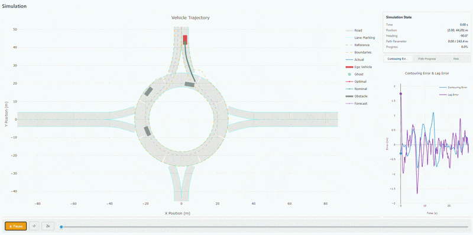
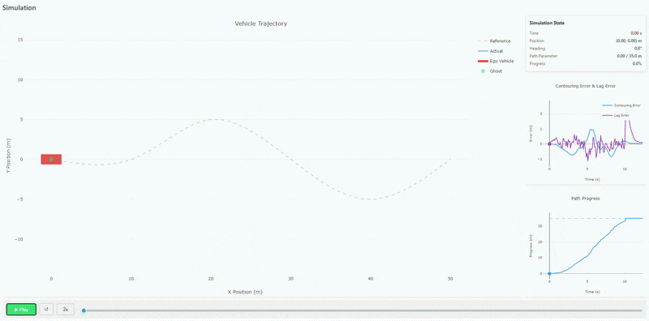

<p align="center">
    <a href="https://risk-metrics.gitlab.io/faran/">
        
    </a>
</p>

[](https://gitlab.com/risk-metrics/faran/-/pipelines) [](https://codecov.io/gl/risk-metrics/faran) [](https://bencher.dev/perf/faran) [](https://pypi.org/project/faran/) [](https://pypi.org/project/faran/) [](https://gitlab.com/risk-metrics/faran/-/blob/main/LICENSE)

> The [GitHub mirror](https://github.com/zuka011/faran) of Faran exists for discoverability. The primary repo is on [GitLab](https://gitlab.com/risk-metrics/faran).

# Faran: A Composable Trajectory Planning Library

Faran provides composable building blocks for trajectory planning in Python, intended for researchers who want a working planner quickly and the flexibility to customize components as needed.

The library includes implementations of [MPPI](https://risk-metrics.gitlab.io/faran/guide/concepts/), dynamics models, samplers, state estimation algorithms, cost functions, and other useful components, with support for both NumPy and JAX backends. The API is flexible, type-safe, and designed to minimize boilerplate.

Faran also provides an optional visualization package, [`faran-visualizer`](https://pypi.org/project/faran-visualizer/), which can generate standalone HTML files for interactive visualizations of simulation results.

<p align="center">
    
</p>

> Faran is being actively developed — expect missing features, [some gotchas](https://risk-metrics.gitlab.io/faran/guide/gotchas/) and possible API changes. See the [roadmap](https://risk-metrics.gitlab.io/faran/guide/features/) for what's available and what's coming. You can help by [reporting issues](https://gitlab.com/risk-metrics/faran/-/issues) or contributing fixes and features.

## Why Faran?

The Python ecosystem has plenty of individual MPPI implementations [1](https://github.com/UM-ARM-Lab/pytorch_mppi), [2](https://github.com/jlehtomaa/jax-mppi), [3](https://github.com/MizuhoAOKI/python_simple_mppi), state estimation libraries [4](https://github.com/rlabbe/filterpy), [5](https://github.com/rlabbe/Kalman-and-Bayesian-Filters-in-Python), and distance computation tools [6](https://github.com/MattiaMontanari/openGJK), but getting them to work together still requires a lot of glue code, plus reimplementing smaller components like cost functions, obstacle tracking, and motion prediction. Faran provides all of these under one roof, with a consistent API across backends.

- **Comprehensive** — Includes all the components needed for a working planner: dynamics models, samplers, state estimation, cost functions, obstacle tracking, and more.
- **Composable** — Swap out a cost function or sampler without reimplementing everything else.
- **Tested** — Extensive test suite covering every component.
- **Backend-agnostic** — Set up your planner with NumPy, then switch to JAX by changing only the imports. No code rewrite needed.

## Installation

Python 3.13+ is required.

```bash
pip install faran          # NumPy + JAX (CPU only)
pip install faran[cuda]    # JAX with GPU support
```

The visualizer CLI can be installed separately:

```bash
pip install faran-visualizer
```

## Quick Start

Here's how you can configure an MPPI planner for the [MPCC](https://risk-metrics.gitlab.io/faran/guide/concepts/mpcc/) formulation, assuming a kinematic bicycle model:

```python
from faran.numpy import mppi, model, sampler, trajectory, types, extract
import numpy as np

reference = trajectory.waypoints(
    points=np.array([[0, 0], [10, 0], [20, 5], [30, 0], [40, -5], [50, 0]]),
    path_length=35.0,
)

planner, augmented_model, contouring_cost, lag_cost = mppi.mpcc(
    model=model.bicycle.dynamical(
        time_step_size=0.1, wheelbase=2.5,
        speed_limits=(0.0, 15.0), steering_limits=(-0.5, 0.5),
        acceleration_limits=(-3.0, 3.0),
    ),
    sampler=sampler.gaussian(
        standard_deviation=np.array([0.5, 0.05]),
        rollout_count=256,
        to_batch=types.bicycle.control_input_batch.create, seed=42,
    ),
    reference=reference,
    # Components do not implicitly assume any semantic meaning for state dimensions.
    position_extractor=extract.from_physical(lambda states: states.positions),
    # Configs are typically typed dicts, so you get IDE support without many imports.
    config={
        "weights": {"contouring": 100.0, "lag": 100.0, "progress": 1000.0},
        "virtual": {"velocity_limits": (0.0, 15.0)},
    },
)
```

Switching `from faran.numpy` to `from faran.jax` uses the JAX backend — same API, no other changes needed.

<details>
<summary><strong>Full example: simulation loop + visualization</strong></summary>

<br>

To see how the planner works, we can collect runtime data as follows:

```python
from faran import access, collectors, metrics

planner = collectors.states.decorating(
    planner,
    transformer=types.augmented.state_sequence.of_states(
        physical=types.bicycle.state_sequence.of_states,
        virtual=types.simple.state_sequence.of_states,
    ),
)
registry = metrics.registry(
    error_metric := metrics.mpcc_error(contouring=contouring_cost, lag=lag_cost),
    collectors=collectors.registry(planner),
)
```

Now we set up a dummy simulation loop.

```python
state = types.augmented.state.of(
    physical=types.bicycle.state.create(x=0.0, y=0.0, heading=0.0, speed=0.0),
    virtual=types.simple.state.zeroes(dimension=1),
)
nominal = types.augmented.control_input_sequence.of(
    physical=types.bicycle.control_input_sequence.zeroes(horizon=30),
    virtual=types.simple.control_input_sequence.zeroes(horizon=30, dimension=1),
)

for _ in range(100):
    control = planner.step(temperature=50.0, nominal_input=nominal, initial_state=state)
    state = augmented_model.step(inputs=control.optimal, state=state)
    nominal = control.nominal
```

Finally, we can visualize the results:

```python
import asyncio
from faran_visualizer import MpccSimulationResult, configure, visualizer

errors = registry.get(error_metric)
result = MpccSimulationResult(
    reference=reference,
    states=registry.data(access.states.require()),
    contouring_errors=errors.contouring,
    lag_errors=errors.lag,
    time_step_size=0.1,
    wheelbase=2.5,
)

configure(output_directory=".")
asyncio.run(visualizer.mpcc()(result, key="quickstart"))
```



</details>

For a step-by-step walkthrough, see the [Getting Started guide](https://risk-metrics.gitlab.io/faran/guide/getting-started/).

## Features

See the [feature overview](https://risk-metrics.gitlab.io/faran/guide/features/) for the full list of supported components, backend coverage, and roadmap.

## Documentation

|                                                                                |                                                                                        |
|--------------------------------------------------------------------------------|----------------------------------------------------------------------------------------|
| [Getting Started](https://risk-metrics.gitlab.io/faran/guide/getting-started/) | Installation, first planner, simulation loop                                           |
| [User Guide](https://risk-metrics.gitlab.io/faran/guide/concepts/)             | Core concepts, models, samplers, costs, obstacles, estimation, risk metrics, and more  |
| [Examples](https://risk-metrics.gitlab.io/faran/guide/examples/)               | End-to-end scenarios with interactive visualizations                                   |
| [API Reference](https://risk-metrics.gitlab.io/faran/api/)                     | Factory functions, protocols, and type documentation                                   |

## Contributing

See [CONTRIBUTING.md](CONTRIBUTING.md) and [DESIGN.md](DESIGN.md).

## Code of Conduct

See [CODE_OF_CONDUCT.md](CODE_OF_CONDUCT.md).

## License

MIT — see [LICENSE](LICENSE).
